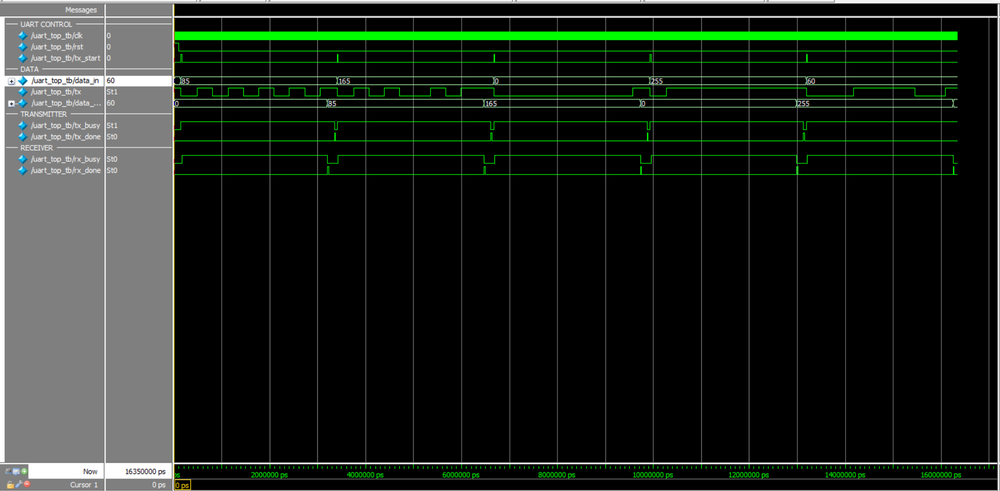
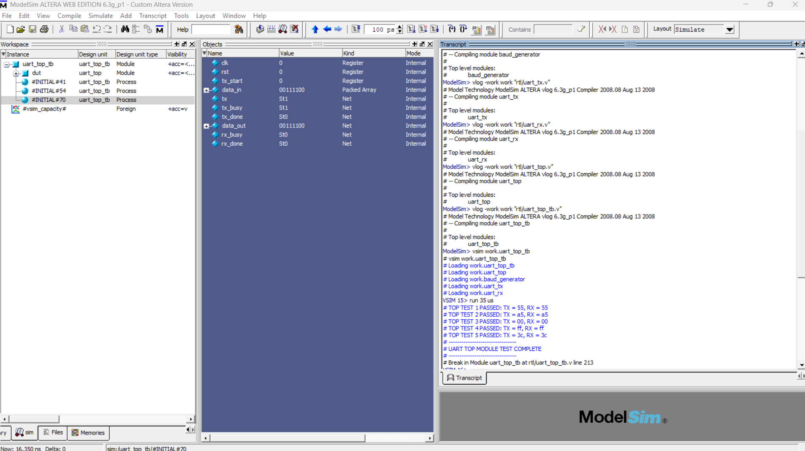
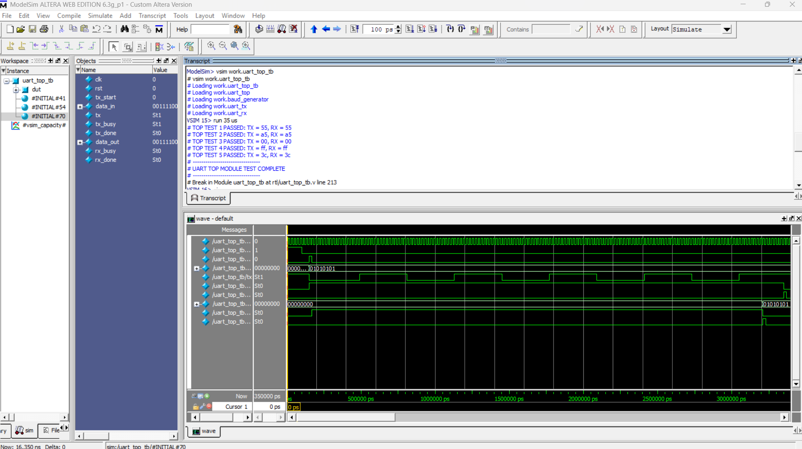

# UART Transmitter and Receiver IP Core

A UART (Universal Asynchronous Receiver/Transmitter) IP Core implemented in Verilog HDL. The design includes a baud-rate generator, UART transmitter, UART receiver, and a top-level module integrating the complete UART communication system.

## Features

- 8-bit UART data transmission and reception
- Start bit, 8 data bits, and stop bit
- Configurable baud-rate generation
- Separate transmitter and receiver modules
- TX busy and done status signals
- RX busy and done status signals
- Loopback communication for verification
- Automated ModelSim simulation using a TCL .do script for compilation simulation, waveform setup, and test execution.
- Multi-byte testbench verification

## Project Structure
```text
UART-Transmitter-Receiver-IP-Core/
│ 
├── rtl/
│   ├── baud_generator.v
│   ├── uart_tx.v
│   ├── uart_rx.v
│   ├── uart_top.v
│   ├── uart_tb.v
│   ├── uart_top_tb.v
│   └── uart.do
│
├── screenshots/
│   ├── 01_modelsim_tests.png
│   ├── 02_uart_top_waveform.png
│   └── 03_modelsim_waveform_detail.png
│
├── docs/
│   └── .gitkeep
│
├── .gitignore
└── README.md
```

## Block Diagram
```text

                 +------------------+
                 |  Baud Generator  |
                 +--------+---------+
                          |
                     baud_tick
                          |
          +---------------+---------------+
          |                               |
          v                               v
+------------------+             +------------------+
| UART Transmitter |             |  UART Receiver   |
|                  |             |                  |
|    data_in       |             |    data_out      |
|    tx_start      |             |    rx_done       |
+--------+---------+             +--------+---------+
         |                                ^
         |                                |
         +---------- UART TX -------------+
```


## Modules

### Baud Generator

Generates the timing tick used by the UART transmitter and receiver.

### UART Transmitter

Converts 8-bit parallel data into a serial UART data stream.

### UART Receiver

Receives the serial UART data and reconstructs the original 8-bit data.

### UART Top

Integrates the baud generator, transmitter, and receiver into one UART IP core.

## Verification

The complete UART design was verified using ModelSim with a multi-byte testbench.

| Test | TX Data | RX Data | Result |
|------|---------|---------|--------|
| 1 | 55 | 55 | PASS |
| 2 | A5 | A5 | PASS |
| 3 | 00 | 00 | PASS |
| 4 | FF | FF | PASS |
| 5 | 3C | 3C | PASS |

### ModelSim Result


TOP TEST 1 PASSED: TX = 55, RX = 55
TOP TEST 2 PASSED: TX = a5, RX = a5
TOP TEST 3 PASSED: TX = 00, RX = 00
TOP TEST 4 PASSED: TX = ff, RX = ff
TOP TEST 5 PASSED: TX = 3c, RX = 3c

--------------------------------
UART TOP MODULE TEST COMPLETE
--------------------------------

## Tools Used

- Verilog HDL
- ModelSim-Altera 6.3g
- GitHub
- GitHub Desktop

## Verification Method

The transmitter output is connected directly to the receiver input in a loopback configuration.


data_in
   |
   v
UART Transmitter
   |
   | TX
   v
UART Receiver
   |
   v
data_out


The transmitted data is compared with the received data for each test case.

## Simulation Waveform

The following waveform shows the UART top-level loopback simulation in ModelSim.



## Simulation Test Results

All five test cases passed successfully.



## Waveform Detail


## Author

Panchajanya Nandamuri
